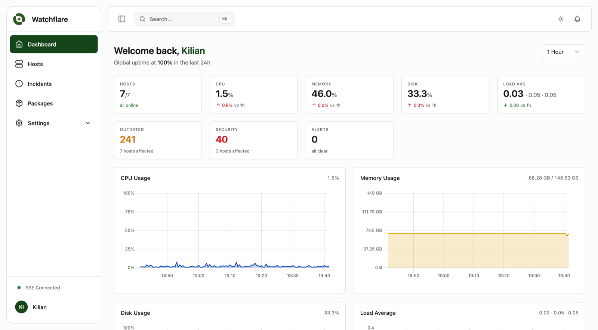
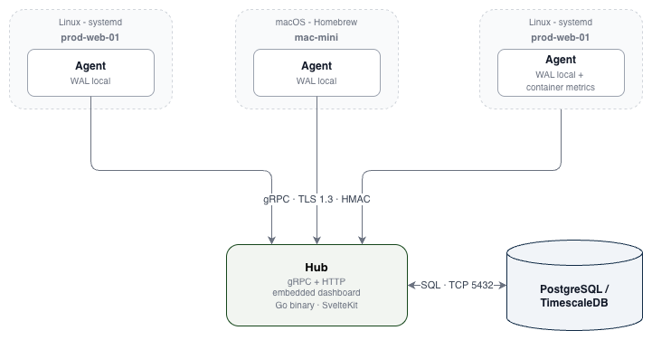
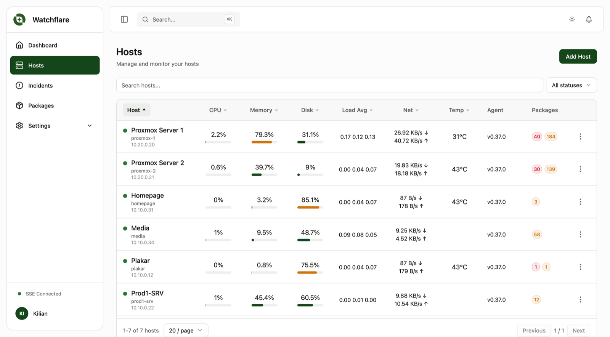
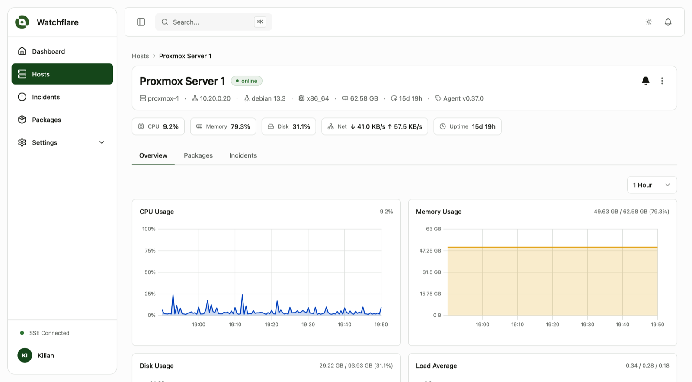
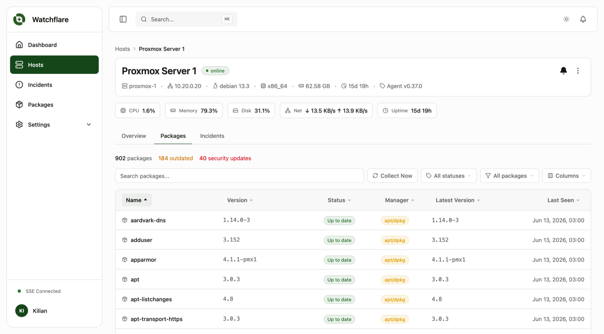
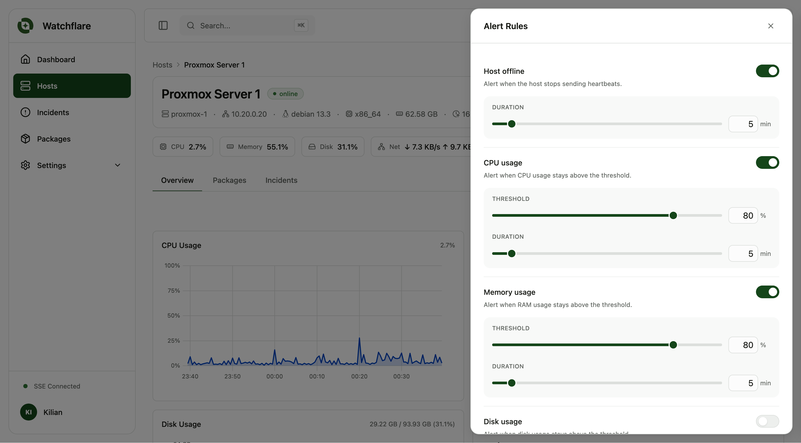

# Watchflare

Self-hosted server monitoring. Real-time metrics, package inventory, and alerts. Deploy via Docker or as a single binary.

[](https://github.com/watchflare-io/watchflare/releases)
[](LICENSE)
[](https://go.dev)
[](https://github.com/watchflare-io/watchflare/pkgs/container/watchflare)

<p align="center">
  <picture>
    <source media="(prefers-color-scheme: dark)" srcset=".github/assets/dashboard-dark.png">
    <source media="(prefers-color-scheme: light)" srcset=".github/assets/dashboard-light.png">
    
  </picture>
</p>

Watchflare collects system metrics in real time, maintains a full package inventory across your servers, and sends alerts when thresholds are exceeded or a host goes offline. Self-hosted: the Hub and database run on infrastructure you choose.

<p align="center">
  
</p>

---

## Why Watchflare?

- **Zero-dependency deployment.** One Go binary embeds the entire web UI, with no Nginx or Node required. A reverse proxy is optional but recommended for HTTPS termination.
- **Flexible TLS.** The Hub generates its own PKI on first run, or you can provide certs from your existing CA. Agents pin the CA at registration.
- **Resilient agents.** A write-ahead log buffers metrics locally when the Hub is unreachable and replays on reconnect. No gaps.
- **Live metrics.** Host status refreshes every 5 seconds, system metrics every 30 seconds, all streamed live to the dashboard via SSE. TimescaleDB continuous aggregates keep historical charts fast across 1h, 12h, 24h, 7d, and 30d ranges.
- **Container metrics.** Per-container CPU, memory, and network for Docker and Podman runtimes. Enabled with the `--containers` install flag.
- **Package inventory.** Tracks installed packages across ~30 package managers with daily delta sync, outdated detection, and security flagging.
- **Self-hosted.** The Hub, database, and agents all run on infrastructure you control. AGPL-3.0 licensed.

## What it monitors

| Category | Metrics |
|----------|---------|
| **CPU** | Usage %, iowait, steal (VMs) |
| **Memory** | Used, available, buffers, cached |
| **Swap** | Used, total |
| **Disk** | Total, used, read/write throughput |
| **Network** | Inbound/outbound bandwidth |
| **Temperature** | CPU and sensor readings (battery, storage, etc.) on physical hosts |
| **System** | Uptime, load average (1/5/15 min), process count |
| **Containers** | Per-container CPU, memory, network (Docker, Podman) |
| **Packages** | Installed packages, versions, outdated detection (~30 package managers) |

---

## Screenshots

### Hosts overview

Every host at a glance with live CPU, memory, disk, network, temperature, agent version, and package status (outdated + security counts).

<picture>
  <source media="(prefers-color-scheme: dark)" srcset=".github/assets/hosts-list-dark.png">
  <source media="(prefers-color-scheme: light)" srcset=".github/assets/hosts-list-light.png">
  
</picture>

### Host detail

Drill into any host for full system metrics with live charts. Continuous TimescaleDB aggregates keep zooming from 1h to 30d instant.

<picture>
  <source media="(prefers-color-scheme: dark)" srcset=".github/assets/host-overview-dark.png">
  <source media="(prefers-color-scheme: light)" srcset=".github/assets/host-overview-light.png">
  
</picture>

### Package inventory

Track every installed package across your fleet. Detect outdated versions and security updates across ~30 package managers (apt, dnf, pacman, brew, npm, pip, cargo, and more).

<picture>
  <source media="(prefers-color-scheme: dark)" srcset=".github/assets/package-inventory-dark.png">
  <source media="(prefers-color-scheme: light)" srcset=".github/assets/package-inventory-light.png">
  
</picture>

### Configurable alert rules

Set thresholds per host with a clean drawer interface. Host offline, CPU, memory, disk usage, and more.

<picture>
  <source media="(prefers-color-scheme: dark)" srcset=".github/assets/alert-rules-dark.png">
  <source media="(prefers-color-scheme: light)" srcset=".github/assets/alert-rules-light.png">
  
</picture>

---

## Quick start

**Requirements:** Docker and Docker Compose v2+.

```bash
mkdir watchflare && cd watchflare && \
  curl -sSLO https://get.watchflare.io/hub/docker-compose.yml
```

Then generate the three required secrets:

```bash
printf "POSTGRES_PASSWORD=%s\nJWT_SECRET=%s\nNOTIFICATION_ENCRYPTION_KEY=%s\n" \
  "$(openssl rand -base64 32)" \
  "$(openssl rand -base64 32)" \
  "$(openssl rand -base64 32)" > .env
```

Start the stack:

```bash
docker compose up -d
```

Open `http://your-host:8080`. On first load you are redirected to create your admin account.

> **Full guide** → [docs.watchflare.io/get-started/quickstart](https://docs.watchflare.io/get-started/quickstart/)

**Binary install (Linux):** Download a pre-built binary from [GitHub Releases](https://github.com/watchflare-io/watchflare/releases) and follow the [binary install guide](https://docs.watchflare.io/hub/binary-install/).

## Install an agent

In the dashboard, create a host and copy the registration token. Then run on the target machine:

**Linux:**
```bash
curl -sSL https://get.watchflare.io | sudo bash -s -- \
  --token wf_reg_YOUR_TOKEN \
  --host YOUR_HUB_IP \
  --port 50051
```

**macOS (via Homebrew):**
```bash
curl -sSL https://get.watchflare.io/brew | bash -s -- \
  --token wf_reg_YOUR_TOKEN \
  --host YOUR_HUB_IP \
  --port 50051
```

The installer registers the agent, writes the config, and starts the service. The host appears online in the dashboard a few seconds later.

---

## Tech stack

| Component | Technology |
|-----------|------------|
| Hub | Go, Gin, gRPC, GORM |
| Frontend | SvelteKit 5, Tailwind CSS v4, uPlot |
| Database | PostgreSQL + TimescaleDB |
| Agent | Go, gopsutil |
| Security | TLS 1.3, HMAC-SHA256, JWT, bcrypt |

---

## Documentation

Full documentation at **[docs.watchflare.io](https://docs.watchflare.io)**

- [Architecture overview](https://docs.watchflare.io/get-started/architecture/)
- [Hub configuration reference](https://docs.watchflare.io/reference/hub-env/)
- [Agent install (Linux)](https://docs.watchflare.io/agent/install/linux/)
- [Agent install (macOS)](https://docs.watchflare.io/agent/install/macos/)
- [Alerts & notifications](https://docs.watchflare.io/monitoring/alerts-notifications/)
- [Package inventory](https://docs.watchflare.io/monitoring/packages/)

---

## Development

```bash
# 1. Start database only
docker compose -f docker-compose-postgres.yml up -d

# 2. Hub (terminal 1)
cd backend && go run .

# 3. Frontend (terminal 2)
cd frontend && npm install && npm run dev   # http://localhost:5173
```

Copy `.env.example` to `.env` and set `POSTGRES_PASSWORD`, `JWT_SECRET`, and `NOTIFICATION_ENCRYPTION_KEY` to random strings (generate each with `openssl rand -base64 32`). On first launch, the Hub redirects you to create your admin account.

See [CONTRIBUTING.md](CONTRIBUTING.md) for the full contribution guide.

---

## License

[AGPL-3.0](LICENSE)
